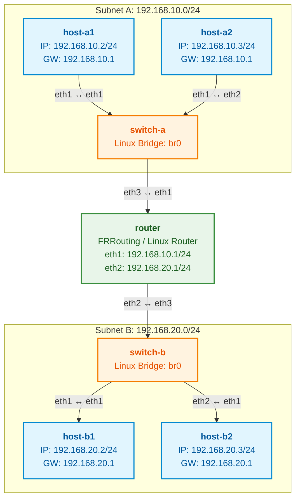

# Lab Assignment: Inter-Subnet Routing with 4 Hosts across 2 Subnets

## Objective
In this lab, you will expand upon basic networking concepts by building and configuring a network topology consisting of **4 hosts divided equally across 2 distinct subnets**, connected via a router (or layer 3 device). You will demonstrate an understanding of IP addressing, subnet masking, host-level network configuration, and router interface/gateway setup required to enable cross-subnet communication.

---

## Lab Topology Overview

Your task is to design and implement a network with the following specification:

---

## Submission Requirements

To receive full credit for this assignment, you must submit the following:

1. **Written Questions & Responses** (in PDF or Markdown format).
2. **Network Topology Configuration File (`topology.yaml`):** A valid YAML configuration file defining your network interfaces, IP addresses, subnets, and routing table setups for all 4 hosts and the router.
3. **[BONUS - 10%] GitHub Repository Submission:**
   - Submit a direct link to a public/accessible GitHub repository containing your `topology.yaml`.
   - The repository root **must** contain a `README.md` file properly documenting the setup instructions, architecture diagram (ASCII or image link), and instructions for executing or verifying the network setup.

---

## Part 1: Router & Host Configuration Questions [Total: 40 Marks]

Answer the following questions concisely and accurately based on networking principles.

### Host-Level Configuration
1. **[5 Marks]** Specify the IP address, subnet mask, and default gateway settings for all 4 hosts (`host-a1`, `host-a2`, `host-b1`, `host-b2`).
2. **[5 Marks]** Explain why `host-a1` can communicate directly with `host-a2` without relying on the router, but requires the router to communicate with `host-b1`. Describe the role of the subnet mask in this decision process.
3. **[5 Marks]** What specific host-level configuration parameter ensures that packets destined for an external network (`192.168.20.0/24`) are directed to the correct router interface? What happens on `host-a1` if this parameter is missing or misconfigured when attempting to ping `host-b1`?
4. **[5 Marks]** When `host-a1` initiates communication with `host-b1` for the first time, what MAC address does `host-a1` resolve via ARP? Explain why it resolves this specific MAC address instead of `host-b1`'s MAC address.

### Router-Level Configuration
5. **[5 Marks]** Detail the configuration required on both router interfaces connecting to Subnet A and Subnet B. Include interface IP addressing and subnet mask parameters.
6. **[5 Marks]** Explain the concept of IP forwarding on the router. What configuration setting or service must be enabled on a Linux/Unix-based router to allow it to pass traffic between Subnet A and Subnet B?
7. **[5 Marks]** Provide the explicit routing table entries required on the router to correctly route traffic between `192.168.10.0/24` and `192.168.20.0/24`. Specify destination subnets, network masks, interface associations, and flags if applicable.
8. **[5 Marks]** Trace the complete ICMP Echo Request and Echo Reply packet flow between `host-a1` and `host-b1`. At each hop (Host A1 -> Router -> Host B1 -> Router -> Host A1), detail how the Source IP, Destination IP, Source MAC, and Destination MAC header fields change.

---

## Part 2: Configuration & YAML Verification [Total: 60 Marks]

Create a file named `topology.yaml` that models your entire network configuration. d

### Grading Criteria for Part 2:
- **Syntactic Validity [15 Marks]:** Correct YAML structure and indentation.
- **Addressing Logic [20 Marks]:** Valid IP assignments without conflicts within subnets.
- **Gateway Matching [15 Marks]:** Subnet gateway definitions matching the router interface IPs.
- **Routing Integrity [10 Marks]:** Correct route mapping to designated interfaces.

---

## Bonus Opportunity [+10% Extra Credit]

To claim the extra **10% bonus marks**:

1. Create a public GitHub repository titled `networking-lab-4hosts-2subnets`.
2. Push your `topology.yaml` file into the root of the repository.
3. Create a well-structured `README.md` in the repository root that includes:
   - **Project Overview:** A short explanation of the lab and network architecture.
   - **Topology Diagram:** An ASCII diagram or image illustrating the connections between the 4 hosts, 2 subnets, and the router.
   - **Verification Instructions:** Instructions on how to validate the syntax of the `topology.yaml` file (e.g., using a Python script or YAML linter tool).
4. Provide the GitHub repository URL in your main lab submission document.
